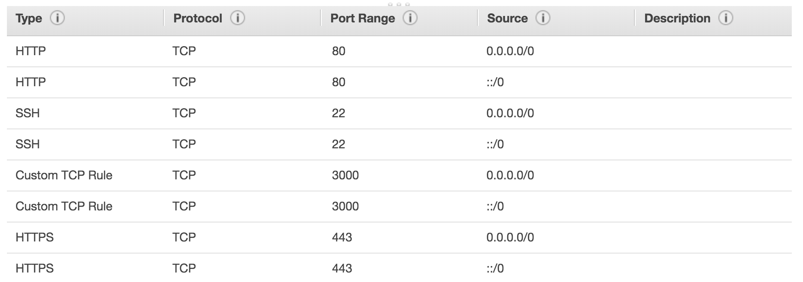
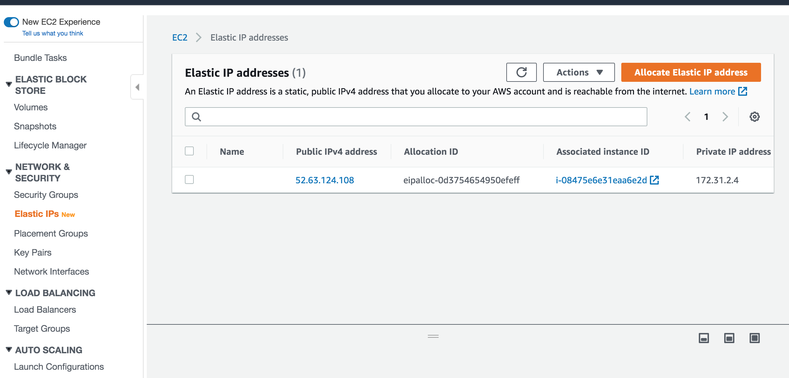
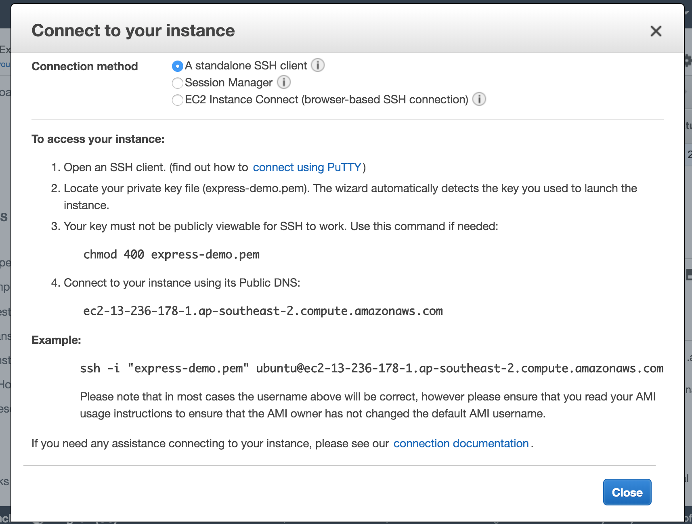
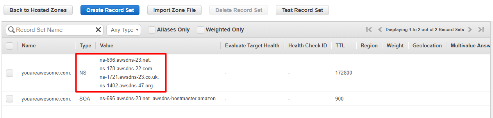
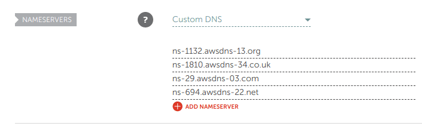
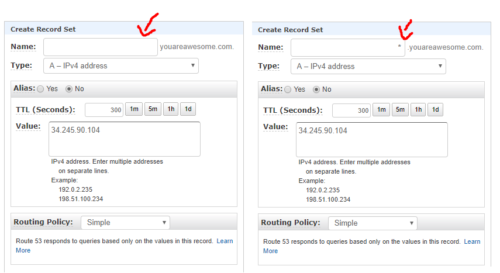

# Setup NodeJS Express App, AWS EC2, AWS Route53, Namecheap Domain, HTTPS

1. Create Node app and deploy to Github
2. Create EC2 Instance
3. SSH into EC2 Instance
4. Setup and Install EC2 Dependencies
5. Create Route 53
6. Purchase Namecheap Domain
7. Setup Nginx and HTTPS

## 1. Create Node app and deploy to Github
Create a simple node express app and deploy to github

```bash
mkdir express_ec2
cd express_ec2 
touch index.js
npm init -y
npm i --save express
echo node_modules >> .gitignore
```

```javascript
let express = require('express')
const PORT = process.env.PORT || 3000

let app = express()

app.get('/', (req, res) => {
  res.send('hi')
})

// Custom 404 route not found handler
app.use((req, res) => {
  res.status(404).send('404 not found')
})

app.listen(PORT, () => {
  console.log(`Listening on PORT ${PORT}`);
})
```

```bash
git add .
git commit -m "initial commit"
git remote add origin "github repo"
git push origin master
```

## 2. Create EC2 Instance
- Login to AWS Management Console
- Select EC2 and select Launch Instance
- Choose latest Ubuntu Server
- Setup security groups including HTTP port 80 and HTTPS

- Create instance and create name of private key and download (you will need this to ssh login to your cloud instance)
- Create Elastic IP and associate to your instance. This will keep a fixed public IP address for your instance


## 3. SSH into EC2 Instance
- Find and select your running EC2 instance and click Connect then follow the instructions

- To asssist workflow create a folder named ssh in your root directory and include in .gitignore. You can keep your private key here and a textline of the ssh script. Then come back to this folder whenever you need to ssh

## 4. Setup and Install EC2 Dependencies
- Install nvm
```
sudo apt-get update
curl -o- https://raw.githubusercontent.com/nvm-sh/nvm/v0.34.0/install.sh | bash
```
- Activate nvm
```
. ~/.nvm/nvm.sh
```
- Use nvm to install latest version of node
```
nvm install node
```
- Clone your repo
```
git clone "link_to_repo"
```
- Install pm2 (similar to forever)
```javascript
// cd in root app folder and install pm2 globally
npm i -g pm2
// setup pm2 to start the server automatically on server restart
pm2 start index.js
pm2 save
pm2 startup
// After runnong pm2 startup command you will get a command starting with sudo. Copy and paste that command from sudo until end of next line and enter
```
## 5. Create Route 53
- Search for Route53 Service
- Get started and create a hosted zone
- Create the hosted zone and enter the domain name you wil purchase from namecheap
- Once clicked you will see the `NS` records. Copy a record of these


## 6. Purchase Namecheap Domain
- Purchase domain from namecheap and then set the Custom DNS to each of the `NS` records from Route53

- Connect your Route 53 to Namecheap. Copy the public "IPv4 Public IP" of your EC2 Instance. Hit create record set button and create 2 records below. One set name as empty while latter prefi with *. Copy into value the IPv4 Public IP address into reach


## 7. Setup Nginx and HTTPS
- SSH into EC2 Instance and setup nginx webserver
```
sudo apt-get install nginx
```
- Install certbot and build certificate
```
sudo apt-get install software-properties-common
sudo add-apt-repository ppa:certbot/certbot
sudo apt-get install python-certbot-nginx
```
- Make the certificate with the given domain names you have purchased. It may prompt for email
```
sudo certbot --nginx -d example.com -d www.example.com
```
- Remove default config file
```
sudo rm /etc/nginx/sites-enabled/default
```
- Create new file 
```
cd /etc/nginx/sites-available/
touch node
cd
sudo /etc/nginx/sites-available/node
sudo vim /etc/nginx/sites-available/node
```
- Paste the following code in the file and replace example.com with your purchased domain and 3000 with your Node port
```
server {
  listen 80;
  listen [::]:80;
  server_name example.com www.example.com;
  return 301 https://$server_name$request_uri;
}

server {
  listen 443 ssl http2 default_server;
  listen [::]:443 ssl http2 default_server;
  server_name example.com www.example.com;

  location / {
    proxy_pass http://localhost:3000;
  }

  ssl_certificate /etc/letsencrypt/live/example.com/fullchain.pem;
  ssl_certificate_key /etc/letsencrypt/live/example.com/privkey.pem;
  ssl_protocols TLSv1 TLSv1.1 TLSv1.2;
  ssl_prefer_server_ciphers on;
  ssl_ciphers EECDH+CHACHA20:EECDH+AES128:RSA+AES128:EECDH+AES256:RSA+AES256:EECDH+3DES:RSA+3DES:!MD5;
  ssl_session_cache shared:SSL:5m;
  ssl_session_timeout 1h;
  add_header Strict-Transport-Security “max-age=15768000” always;
}
```
- Symlink config file to sites-enabled 
```
sudo ln -s /etc/nginx/sites-available/node /etc/nginx/sites-enabled/node
```
- Restart nginx and apply
```
sudo service nginx restart
```

### Reference
[Link to helpful setup tutorial article](https://shaneoneill.io/2018/10/21/setting-up-an-https-site-using-nodejs-aws-ec2-nginx-lets-encrypt-and-namecheap/)